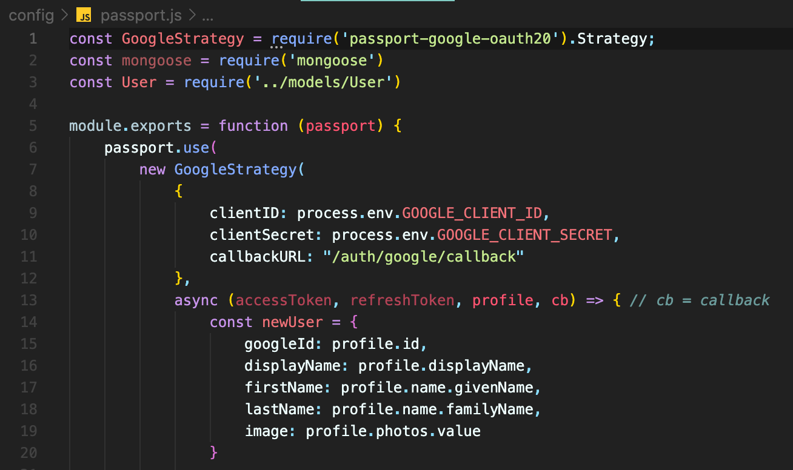

# SGUniGo 🎓

A joint university application portal for prospective undergraduates in Singapore, as inspired by UK's UCAS.

## 1. Requirements
Make sure your WAMP/MAMP server and Docker engine is running, and that ports 3001 (used as Docker's published port) and 5762 (used by RabbitMQ) are free.

## 2. Setup Instructions
1. Go to the root of the project.
2. Check your environment variables in `.env`. (Mac users should have a default port of 8889 and passwword `:root`.
3. Run the shell command:

For Windows users, execute the following:
```
bash dock.bat
```
For Mac users:
```
bash dock.sh
```
Finally, access the app via http://localhost:3001/.

#### If you only want to load the frontend:
1. Go into the `app` directory from the root folder.
```
cd app
```
2. Install node modules.
```
npm install
```
3. Start your localhost in dev mode.
```
npm run dev
```
You will be able to access the app via http://localhost:3001/.

## 3. More on this project
### 1. Why use Node.js
Node.js is a backend platform for supporting routing to different pages of our website, accepting authentication<br>

#### Mainly due to SingPass' API
⚠️ The main reason we need to use Node.js is due to SingPass' MyInfo API. The developers at SingPass wrote the API in Node.js, and this involved many files (as seen on the [MyInfo GitHub repo](https://github.com/ndi-trusted-data/myinfo-demo-app)).<br>
To rewrite their entire code in Flask would be too tedious and error-prone, so this means it's best to do the retrieval of MyInfo data in Node.js itself.<br>

Many node module packages are installed because of this, as seen in *package.json > dependencies*. The following packages deal with the encryption and safe retrieval of MyInfo data from the API:
1. bluebird
2. jose
3. jsonwebtoken
4. nonce  

Some of the other packages are for Google's authentication service, while others I'm not too sure. But I think we can just ignore them for now as long as our microservice works.

#### Better for Google authentication
Node.js has an established package manager (i.e. NPM), and one of the packages it manages is **Passport.js**. This allows for the easier integration of Google OAuth 2.0 and the recording of sessions in the database.<br>



Besides Passport.js, we also have other packages installed in SGUniGo such as express-session, connect-mongo, mongoose, etc. to mainly help with the following feature:<br>

1. 🍪 **Allow sessions on SGUniGo**
    - Users not logged in cannot access their applications, payment or profile page.
    - All users who have a current session will also be redirected to their applications page if they access the SGUniGo home page.
    - Session data is saved in MongoDB Atlas, a cloud and NoSQL databse connected to SGUniGo. The MONGO_URI can be seen in *config > development.env* or *production.env*, depending on the command you run in the CLI (i.e. `npm run dev` *or* `npm start`, respectively). It is connected via the Mongoose package in *config > db.js*.

### 2. Using Express.js
Express.js is a framework for Node.js, which makes writing the code easier.

### 3. Function of new folders + files

#### 📂 app/config
To set "environment variables" such as port number, database URI, etc. This is required by Node.js so it knows which port to listen on, where to post data, and identifiers needed for APIs.

#### 📂 app/lib/security
Required by SingPass MyInfo.

#### 📂 app/middleware
Used to prevent users from accessing pages when they have not logged in.

#### 📂 app/models
Schema for MongoDB; it defines the information that gets posted to the database.

#### 📂 app/public
Utilities like CSS, JS, jQuery, bootstrap.

#### 📂 app/routes
Needed by Express.js to identify which files to load based on the URL.

#### 📂 app/ssl
Strictly to store keys for SingPass' API.

#### 📂 app/views
Stores files that function like HTML, but with less clutter.

⚠️ These files have the extension *.hbs*, which stands for Handlebars, a simple templating language.

#### 📄 .gitignore
The files/folders that will not get pushed through Git.

#### 📄 app/app.js
Main file for Express/Node.js to determine routing and handling of packages.

#### 📄 app/package.json
Contains metadata regarding the whole project, node packages involved and commands to follow when running the project.
