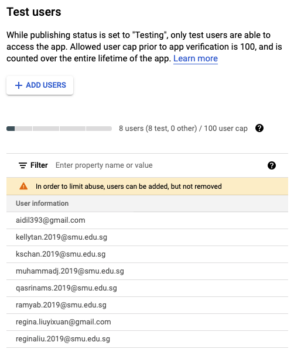

# SGUniGo

#### Current status of Netlify (Thu, 25 Mar at 8PM): ❌
https://sgunigo.netlify.app

It is not supposed to display anything. The *html* directory has been migrated to *views*, so the *netlify.toml* file is pointing to the *views* folder. However, Netlify's default configuration does not support *.hbs* files, but it's ok for now.<br><br>
We can try to piece everything together on Netlify after **we make sure all microservices work on localhost first**. We may even eventually shift to another PaaS (e.g. Heroku) that supports Docker, or not submit an online version at all (as it's not the requirement).<br>

#### Current status of Heroku (Fri, 26 Mar at 1PM): ✅½
https://sgunigo.herokuapp.com<br>

Heroku supports Node.js, so the pages can be loaded here. However, some stylings and pages went wrong so that needs some fixing on Heroku's side. We can add new collaborators for free on Heroku so this will be more transparent for everyone.<br><br>

More info here: [Netlify vs Heroku | What are the differences?](https://blog.back4app.com/netlify-vs-heroku/)

## How to run app (on localhost)
Run this in the command line:
```
npm run dev
```
Go to http://localhost:3001 to view app.

## Outline
1. Regarding New Commits
    1. Why use Node.js
    2. Using Express.js
    3. Function of new folders + files
2. Other Info

## Regarding New Commits

### 1. Why use Node.js
Node.js is a backend platform for supporting routing to different pages of our website, accepting authentication<br>

#### Mainly due to SingPass' API
⚠️ The main reason we need to use Node.js is due to SingPass' MyInfo API. The developers at SingPass wrote the API in Node.js, and this involved many files (as seen on the [MyInfo GitHub repo](https://github.com/ndi-trusted-data/myinfo-demo-app)).<br>
To rewrite their entire code in Flask would be too tedious and error-prone, so this means it's best to do the retrieval of MyInfo data in Node.js itself.<br>

Many node module packages are installed because of this, as seen in *package.json > dependencies*. The following packages deal with the encryption and safe retrieval of MyInfo data from the API:
1. bluebird
2. jose
3. jsonwebtoken
4. nonce  

Some of the other packages are for Google's authentication service, while others I'm not too sure. But I think we can just ignore them for now as long as our microservice works.

#### Better for Google authentication
Node.js has an established package manager (i.e. NPM), and one of the packages it manages is **Passport.js**. This allows for the easier integration of Google OAuth 2.0 and the recording of sessions in the database.<br>


Besides Passport.js, we also have other packages installed in SGUniGo such as express-session, connect-mongo, mongoose, etc. to mainly help with the following feature:<br>

1. 🍪 **Allow sessions on SGUniGo**
    - Users not logged in cannot access their applications, payment or profile page.
    - All users who have a current session will also be redirected to their applications page if they access the SGUniGo home page.
    - Session data is saved in MongoDB Atlas, a cloud and NoSQL databse connected to SGUniGo. The MONGO_URI can be seen in *config > config.env*. It is connected via the Mongoose package in *config > db.js*.

### 2. Using Express.js
Express.js is a framework for Node.js, which makes writing the code easier.

### 3. Function of new folders + files

#### 📂 config
To set "environment variables" such as port number, database URI, etc. This is required by Node.js so it knows which port to listen on, where to post data, and identifiers needed for APIs.

#### 📂 images
To store images and screenshots used in this README.md file.

#### 📂 lib/security
Required by SingPass MyInfo.

#### 📂 middleware
Used to prevent users from accessing pages when they have not logged in.

#### 📂 models
Schema for MongoDB; it defines the information that gets posted to the database.

#### 📂 public
Utilities like CSS, JS, jQuery, bootstrap.<br>

⚠️ Express.js recognises the *public* folder. If you want to reference a CSS stylesheet, you can simply type '/css/example.css' instead of typing relative paths like '../../css/example.css'.<br>

**So all the JS, CSS etc. files will be referenced from here.**

#### 📂 routes
Needed by Express.js to identify which files to load based on the URL.

#### 📂 ssl
Strictly to store keys for SingPass' API.

#### 📂 views
Stores files that function like HTML, but with less clutter.<br>

⚠️ These files have the extension *.hbs*, which stands for Handlebars, a simple templating language.<br>

If we just use HTML and want to change a link in the header or footer, we have to go into all files to make the single change. With Handlebars, we can separate the header/fooder section from the rest of the HTML by putting it in an individual file. (See *views > layouts > main.hbs*.) <br>

If we want to go to the login page, we can then tell Express.js that we want a certain file, e.g. *login.hbs*, and add it to the template *main.hbs* to render the full page for the client.

The same goes for any other components (e.g. navbar, menu) that is duplicated across different pages. These are stored in *views* > *partials*.<br>

You can treat *.hbs* just like HTML. You may find the different pages here:
1. index.hbs
2. login.hbs
3. profile.hbs
4. applications/index.hbs
    - Shows list of applications the user has submitted.
5. applications/apply.hbs
    - Application form
6. applications/payment.hbs
7. applications/paypal.hbs
<br>

**❗️ NOTE**<br>
The files are renamed from the *'2login'* format to just *'login'*. It feels like it would be easier for the user to understand when looking at the URL, e.g. www.sgunigo.netlify.app/login.<br>

The same goes for renaming *'3userpage'* to *'applications'*. I think the latter carries more meaning in conveying that the page is a list of his/her submitted applications.

**If we keep this .hbs change, then the HTML folder will not be used anymore.**

#### 📄 .gitignore
The files/folders that will not get pushed through Git.

#### 📄 app.js
Main file for Express/Node.js to determine routing and handling of packages.

#### 📄 netlify.toml
Instructions for Netlify that changes the default way they load our repo.

#### 📄 package.json
The "director" of a Node.js project.<br>

Contains metadata regarding the whole project, node packages involved and commands to follow when running the project.

## Other Info
### Google OAuth client
DO NOT SHARE!

#### Production
Client ID: 919348868535-r7hk6ldskidu8r4smarkaadhaa24s4se.apps.googleusercontent.com<br>
Client Secret: 5rgJex2aRF1g04I_YVktZg_Z

#### Testing
Client ID: 564255958454-or392ml3skef9gj0ga1ohet6qogck68l.apps.googleusercontent.com<br>
Client Secret: JDMauOx7bS6hOrh8639auG-y

#### Emails that can use Google OAuth
